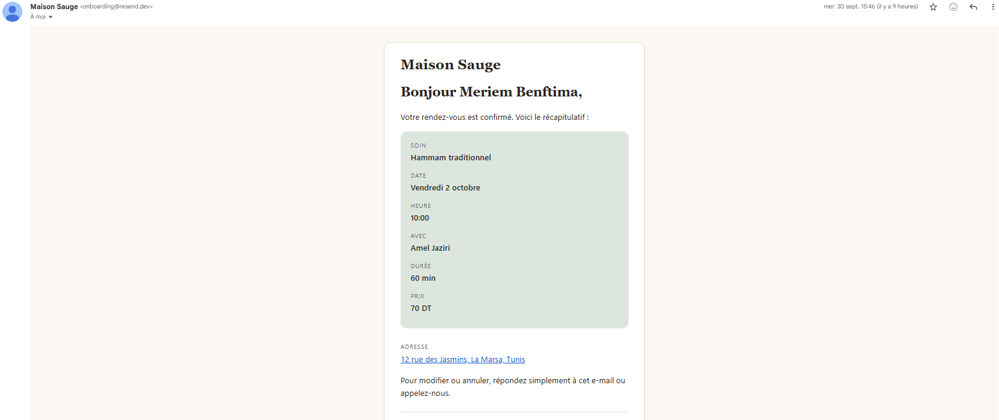

# Maison Sauge: a bilingual booking site

> A bilingual (French / English) website for a beauty & wellness salon where clients see the treatments and book an appointment online in under a minute, while the non-technical owner manages services, staff, hours and bookings from a branded admin panel.

**Live site:** https://booking-site-eight-pi.vercel.app · **Code:** https://github.com/mariembenftima/booking-site ·

---

## 1. The problem

Many small salons in Tunisia still take appointments through Instagram DMs, WhatsApp and phone calls. That works until it doesn't:

- **Double bookings:** two clients are promised the same slot because messages are answered in the wrong order.
- **Missed messages:** a request read at 23:00 is forgotten by morning, and the client books elsewhere.
- **One language only:** clients who prefer English (or French) get a worse experience.
- **No overview:** the owner can't see the week's schedule in one place.

Maison Sauge is a fictional salon used as a realistic demo. The goal was a site the owner could actually run without a developer.

## 2. My role & the stack

**Solo project.** I designed, built and deployed everything: data model, booking logic, UI, emails, SEO and hosting.

| Choice | Why |
| --- | --- |
| **Next.js 16** (App Router, Server Actions) | Server Components fetch data directly; Server Actions keep booking logic and database access on the server. |
| **Payload CMS 3** | Runs *inside* the Next.js app: one deploy, shared TypeScript types, and a ready-made admin panel for the owner. |
| **Neon Postgres** | Serverless Postgres with pooled connections, and branching to test against a copy of production data. |
| **Vercel + Vercel Blob** | Zero-config deploys on every push; Blob gives uploaded photos permanent storage and a CDN. |
| **next-intl** | Locale routing (`/fr`, `/en`), type-safe UI messages, `hreflang` support. |
| **Resend + React Email** | Transactional emails written as React components, in the client's language. |
| **Zod** | Validates everything that comes from the browser before it touches the database. |
| **Tailwind + shadcn/ui** | Fast, accessible components themed with a custom design system ("Maison Sauge": sage, cream, Cormorant Garamond + Geist). |

**White-label by design:** the code uses generic names (`Services`, `Resources` = a person *or* a place), all business content lives in Payload, and the brand lives in CSS variables. The same codebase can become a padel-court or clinic booking site with a new database and colour block.

## 3. Key features

**Two languages, edited by the owner.** Fixed UI text lives in typed JSON files; business content (services, bios, tagline) is localized in Payload, with French as a fallback.

**Live availability, no double bookings.** Free times are *computed*, never stored: opening hours (including lunch breaks and holidays), slot interval, service duration, staff who offer the service, existing bookings and the current time.

**Confirmation emails in the client's language.** The client gets a recap (treatment, date, time, staff, price, address); the owner gets a notification and can reply straight to the client.

**An admin panel a non-technical owner can use.** Branded with the salon's name, leaf icon and sage colours. The owner edits services, staff, hours and closed dates in both languages, and sees every booking.

**Built to be found and shared.** Per-page titles and descriptions in both languages, `hreflang` alternates, a dynamic sitemap with dates from Payload, `robots.txt`, and a generated Open Graph image per language.

## 4. Challenges overcome

### Two people booking the same slot at the same moment
- **Problem:** two clients could book the same staff member at the same time if they clicked "Confirm" within milliseconds of each other.
- **Why:** both requests checked availability *before* either one saved, so both saw the slot as free.
- **What I did:** every booking gets a `slotKey` (`resourceId + start time`) with a **unique constraint**, so Postgres itself rejects the second insert. The Server Action catches that error and automatically tries the next free staff member; if there is none, it shows "This slot was just taken" and refreshes the list. Cancelling a booking rewrites its key, freeing the slot.
- **Result:** tested with two browser tabs confirming the same slot: exactly one booking succeeds; the other gets a friendly message.

### Production builds freezing on a hidden question
- **Problem:** Vercel builds hung forever at `payload migrate`.
- **Why:** my local development server had been pointed at the production database. Payload's dev mode pushes schema changes automatically, which left a marker that made the production migration stop and ask an interactive yes/no question nobody could answer.
- **What I did:** separated the environments for good: production uses migrations only; locally I use a **Neon branch** (an instant copy of production data) that can be reset in one click. Rule: compare database *hosts*, never names.
- **Result:** builds run unattended again, and I can test against realistic data without risking production.

### Image uploads failing only in production
- **Problem:** uploading a photo worked locally but crashed on the live site (`mkdir 'media'`, then `column "_objectkey" does not exist`).
- **Why:** the Vercel Blob storage plugin was *on* in production but *off* on my machine, so the migration and admin import map I generated locally didn't include what the plugin needs.
- **What I did:** gave the local environment the same Blob token so both environments share one configuration, then regenerated the import map and the migration.
- **Result:** uploads persist across deploys, and this whole class of "works locally, breaks live" bugs disappeared.

### One client in two places at once
- **Problem:** found during edge-case testing: the same client could book a hammam with one staff member and a manicure with another *at the same time*.
- **Why:** availability only checked each staff member's schedule, not the client's.
- **What I did:** before saving, the Server Action looks for a confirmed booking with the same (lower-cased) email that overlaps the new one.
- **Result:** the second booking is refused with a clear message; back-to-back bookings still work.

### Smaller ones worth mentioning
- **Fully booked days left clients guessing** → the page now suggests the next available date and jumps the calendar there in one click.
- **Daylight saving and time zones** → bookings are stored in UTC and shown in the business time zone; check scripts cover the two DST switch days. Weekday names are formatted at noon UTC so they never shift a day.
- **Slow first image (LCP)** → the first service photo was lazy-loaded and served through an extra server hop. Loading it eagerly with high priority and serving media straight from the Blob CDN fixed it.
- **Type safety caught real bugs** → `getLocale()` returns a plain string, so every page narrows it with `hasLocale()` before using it; a check file makes `tsc` fail if a translation key is missing in one language.

## 5. Results

**Lighthouse (mobile, Services page):** Performance **96** · Accessibility **98** · Best Practices **100** · SEO **92**

- Page load on mobile: 
- Business logic covered by check scripts: time-zone conversion (5 checks) and availability (8 checks: overlaps, multiple staff, holidays, past times, lunch breaks, two DST days).
- _If a real business uses it: bookings per week, hours saved on DMs and calls._

## 6. What I'd do next

- **Cancellation link in the email** so clients can cancel or reschedule themselves (plus a cancellation email).
- **Reminders** by email or SMS the day before the appointment.
- **Online deposit or payment** to reduce no-shows.
- **Google Calendar sync** for each staff member.
- **Database-level overlap protection** (a Postgres exclusion constraint on time ranges), so overlapping bookings with *different* start times are also impossible under heavy concurrency.
- **Direct browser uploads** for large photos (above Vercel's 4.5 MB request limit).
- **Multi-tenant mode:** one deployment serving several businesses, instead of one deployment per business.

## 7. Links

- **Live site:** https://booking-site-eight-pi.vercel.app
- **GitHub repository:** https://github.com/mariembenftima/booking-site

