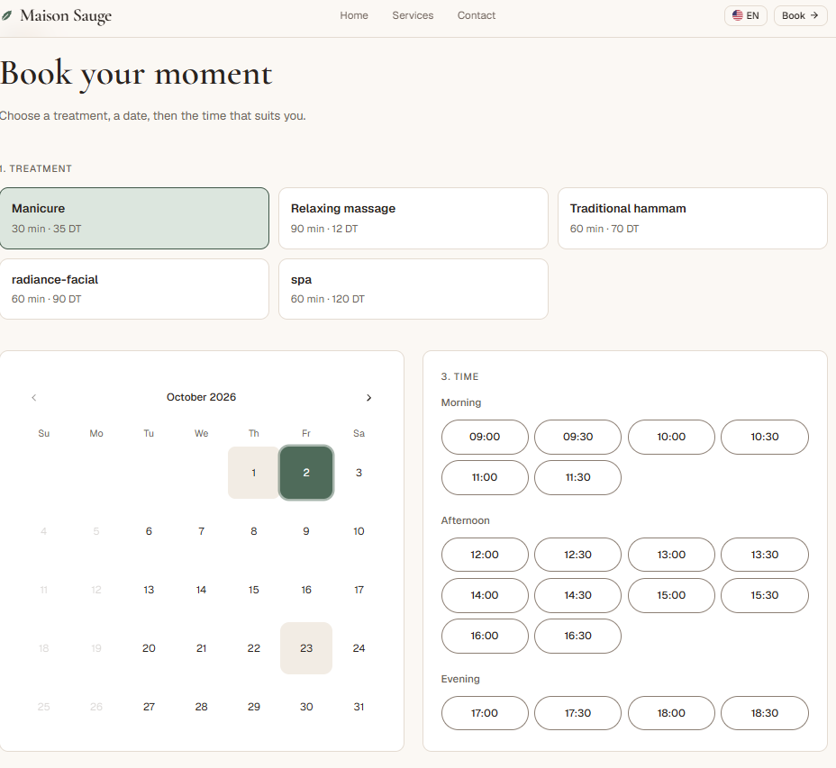
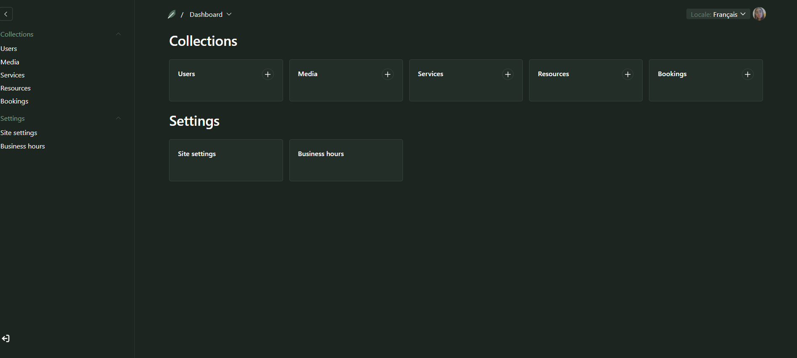

# Maison Sauge · Bilingual booking site

A bilingual (French / English) website for a beauty & wellness salon: clients browse treatments and **book online in under a minute**; the owner manages services, staff, hours and bookings from a **branded admin panel**.

**🌍 Live:** https://booking-site-eight-pi.vercel.app · **📝 Case study:** [CASE_STUDY.md](CASE_STUDY.md) · **🎬 Video:** _[Loom link]_


## Features

- **Two languages** (`/fr`, `/en`) with a flag switcher, `hreflang` links and content the owner edits in both languages
- **Live availability**: free times computed from opening hours, lunch breaks, holidays, service duration, staff and existing bookings
- **No double bookings**: a unique `slotKey` per staff member and start time, enforced by Postgres
- **Smart booking rules**: same client can't overlap themselves, next available date on fully booked days, booking window, past times hidden
- **Confirmation emails** in the client's language (client + owner), built with React Email
- **Branded admin panel** (Payload CMS) a non-technical owner can use
- **SEO**: per-page metadata, dynamic sitemap, `robots.txt`, generated Open Graph image per language
- **Lighthouse (mobile):** Performance 96 · Accessibility 98 · Best Practices 100 · SEO 92

| Booking | Admin |
| --- | --- |
|  |  |

## Tech stack

**Next.js 16** (App Router, Server Actions) · **Payload CMS 3** · **Neon Postgres** · **Vercel** + **Vercel Blob** · **next-intl** · **Resend** + **React Email** · **Zod** · **Tailwind CSS** + **shadcn/ui** · **TypeScript**

Why each one: see [CASE_STUDY.md › My role & the stack](CASE_STUDY.md#2-my-role--the-stack).

## Project structure

```
src/
├── app/
│   ├── (frontend)/[locale]/     # public site: /fr, /en
│   │   ├── page.tsx             # home
│   │   ├── services/  contact/  booking/
│   │   ├── booking/actions.ts   # Server Actions: fetchSlots, findNextAvailable, createBooking
│   │   └── og/route.tsx         # Open Graph image per language
│   ├── (payload)/               # Payload admin (/admin) and API (/api)
│   ├── sitemap.ts  robots.ts
├── collections/                 # Users, Media, Services, Resources, Bookings
├── globals/                     # SiteSettings, BusinessHours
├── components/                  # Header, Footer, LanguageSwitcher, booking/BookingPicker, admin/
├── emails/                      # React Email templates
├── lib/                         # business logic (no UI)
│   ├── time.ts                  # time-zone helpers (store UTC, show business time)
│   ├── availability.ts          # pure slot computation
│   ├── getAvailability.ts       # loads Payload data → availability
│   ├── sendBookingEmails.tsx
│   └── *.check.ts               # check scripts for the logic
├── i18n/                        # next-intl routing, request config, navigation
├── messages/fr.json, en.json    # fixed UI text (typed)
├── proxy.ts                     # language detection (skips /admin, /api, files)
└── payload.config.ts
```

## Getting started

**Requirements:** Node.js 20+, a [Neon](https://neon.tech) Postgres database, and (optional) [Resend](https://resend.com) and Vercel Blob tokens.

```bash
git clone https://github.com/mariembenftima/booking-site.git
cd booking-site
npm install
cp .env.example .env      # Windows PowerShell: Copy-Item .env.example .env
```

Fill in `.env` (see the table below), then:

```bash
npm run dev
```

Open http://localhost:3000/admin, create the first admin user, then add:

1. **Settings → Site settings**: business name, tagline, contact details
2. **Settings → Business hours**: slot interval and opening hours per weekday
3. **Services** (in French and English) and **Resources** (staff), linking each resource to its services

The site is then live at http://localhost:3000/fr and `/en`.

### Environment variables

| Variable | Purpose |
| --- | --- |
| `DATABASE_URL` | Neon **pooled** connection string (`…-pooler…`, `sslmode=verify-full`) |
| `PAYLOAD_SECRET` | Random secret, e.g. `node -e "console.log(require('crypto').randomBytes(32).toString('hex'))"` |
| `BLOB_READ_WRITE_TOKEN` | Vercel Blob token (uploads go to the Blob CDN) |
| `BUSINESS_TIMEZONE` | IANA time zone of the business, e.g. `Africa/Tunis` |
| `RESEND_API_KEY` | Resend API key for booking emails |
| `EMAIL_FROM` | Sender, e.g. `Maison Sauge <bookings@yourdomain.com>` |
| `OWNER_EMAIL` | Optional override for the owner notification (useful in Resend test mode) |
| `NEXT_PUBLIC_SITE_URL` | Public URL, used for canonical links, sitemap and Open Graph |

> ⚠️ **Never point your local `.env` at the production database.** Payload's dev mode pushes schema changes automatically, which breaks production migrations. Use a separate database or a Neon branch of production.

## Useful commands

| Command | What it does |
| --- | --- |
| `npm run dev` | Start the dev server |
| `npm run ci` | `payload migrate && next build` (the Vercel build command) |
| `npx tsc --noEmit` | Type-check the whole project |
| `npx payload generate:types` | Regenerate `payload-types.ts` after changing a collection or global |
| `npx payload migrate:create <name>` | Create a migration for schema changes (commit it!) |
| `npx payload generate:importmap` | Register new admin components |
| `npx tsx src/lib/availability.check.ts` | Run the availability checks (8 cases, including DST) |
| `npx tsx src/lib/time.check.ts` | Run the time-zone checks |

## Deployment (Vercel)

1. Import the repository in Vercel (framework: Next.js)
2. **Storage** → create a **Blob** store and connect it
3. Add every environment variable above (with the **production** database URL and site URL)
4. **Build command:** `npm run ci` (runs pending migrations before each build)

Every push to `main` deploys automatically.

## Reuse for another business

The code is white-label: collections use generic names (`Services`, `Resources` = a person *or* a place), all business content lives in Payload, and the brand lives in CSS variables in `src/app/(frontend)/styles.css`. A new business = a new deployment with its own database, content and colour block.

## Author

**_[Your full name]_**, software engineer · [GitHub](https://github.com/mariembenftima) · _[LinkedIn]_
